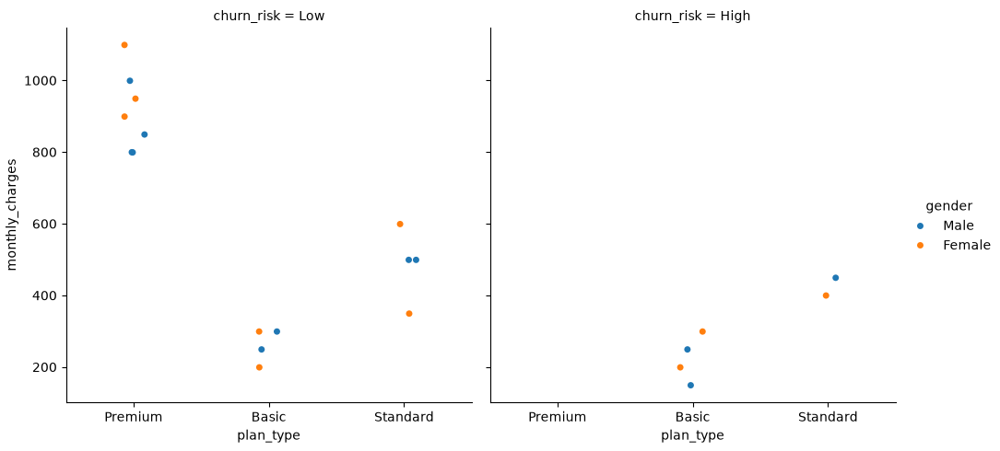
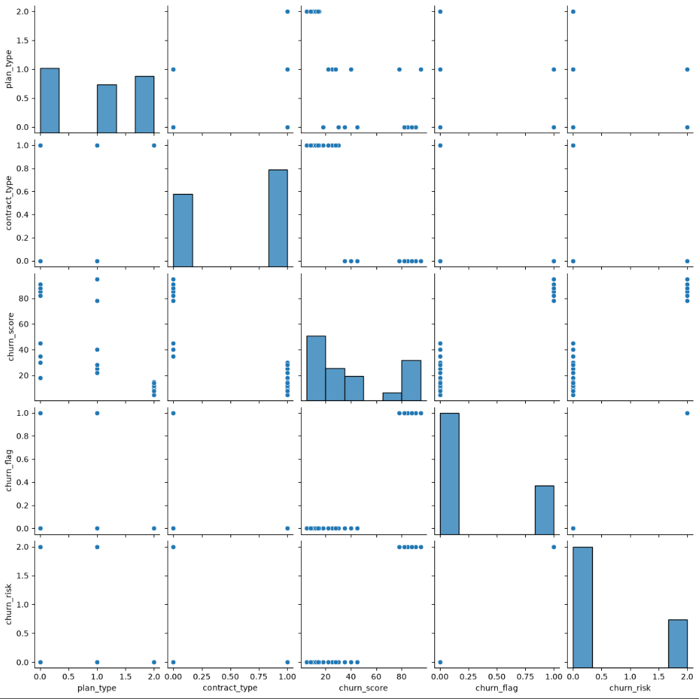
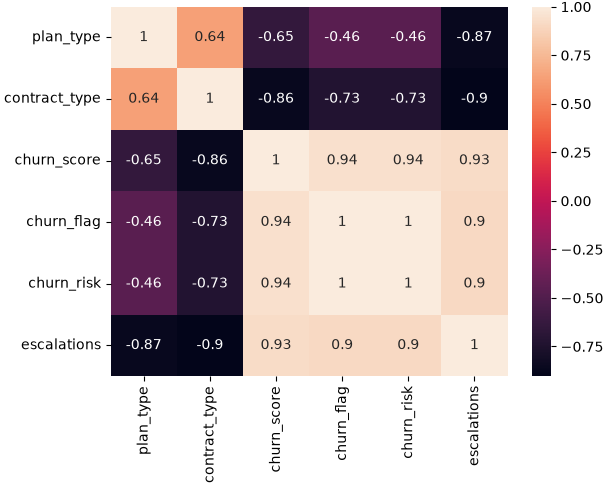

# SQL-Python-Churn-Analytics

## 📌 Project Overview

An end-to-end Customer Churn Analytics project built using Python, Pandas, SQLite, SQL, and Data Visualization.

The project analyzes subscriber behavior for an OTT platform and identifies customer churn patterns, revenue leakage, support-driven churn, and high-risk customer segments.

The objective was to transform raw subscription data into actionable business insights that can improve retention and maximize revenue.

---

## 🎯 Business Objective

The company wants to understand:

- Why customers churn
- Which customers are most likely to churn
- Which plans generate the highest churn
- How churn impacts revenue
- Whether customer support issues influence churn
- Which customer segments should be prioritized for retention

---

## 🛠 Tools & Technologies

- Python
- Pandas
- NumPy
- SQLite
- SQL
- Matplotlib
- Seaborn
- Jupyter Notebook

---

## 📊 Key Metrics

| KPI | Value |
|-------|--------|
| Churn Rate | 28.57% |
| Retention Rate | 71.43% |
| Average Customer Age | 27 Years |
| Average Customer Tenure | 992 Days |
| Revenue Lost Due To Churn | ₹1,744 |
| Escalation Rate | 0.89 |
| Avg Complaints Per User | 0.43 |
| Escalation vs Churn Correlation | 0.90 |

---

# Business Questions & Insights

## 1️⃣ What is the overall customer churn rate?

### Findings

- Churn Rate = 28.57%
- Retention Rate = 71.43%

### Insight

The platform retains over 70% of its customer base. However, nearly one-third of customers eventually churn, indicating a clear opportunity for retention improvements.

---

## 2️⃣ Which subscription plans experience the highest churn?

| Plan Type | Churn Rate |
|------------|------------|
| Basic | 50.00% |
| Standard | 33.33% |
| Premium | 0.00% |

### Insight

Premium subscribers show perfect retention while Basic plan users contribute the majority of churn.

---

## 3️⃣ Which regions experience the highest churn?

### High Churn States

- Kerala
- Madhya Pradesh
- Tamil Nadu
- Telangana

### Insight

Customer churn is concentrated in a few specific regions, suggesting possible pricing, service quality, or content preference issues.

---

## 4️⃣ Which subscription type is most valuable?

| Subscription Type | Revenue | Churn Rate |
|------------------|----------|------------|
| Postpaid | ₹101,100 | 7.69% |
| Prepaid | ₹31,100 | 62.50% |

### Insight

Postpaid subscribers generate more than three times the revenue while maintaining significantly lower churn rates.

---

## 5️⃣ What is the average customer tenure?

### Finding

Average customer tenure is:

**992 Days (~2.7 Years)**

### Insight

Customers who stay subscribed tend to remain active for long periods, indicating strong long-term engagement.

---

## 6️⃣ Does customer support impact churn?

### Findings

- Escalation Rate = 0.89
- Average Complaints Per User = 0.43
- Escalation vs Churn Correlation = 0.90

### Insight

Support escalations are highly correlated with churn, making customer support quality a major driver of customer retention.

---

# 📈 Advanced Analytics

## Churn & Revenue Impact Analysis

- Built an end-to-end churn analytics pipeline across subscription plans, acquisition channels, and contract structures.
- Generated 20+ business KPIs.
- Quantified revenue leakage and customer lifetime value erosion caused by churn.
- Recommended contract-migration retention strategies to reduce subscriber loss.

---

## Risk Scoring & Customer Segmentation

- Developed a churn risk scoring model using subscription tenure, plan type, contract structure, and escalation behavior.
- Segmented customers into risk categories.
- Identified major lifetime value differences between retained and churned customers.
- Recommended prioritizing Premium annual-plan retention over Basic monthly-plan acquisition.

---

## Support Intelligence & Cancellation Analysis

- Integrated complaint, escalation, and subscription datasets.
- Identified strong relationships between escalations and churn behavior.
- Analyzed cancellation drivers including:
  - Pricing sensitivity
  - Competitor switching
  - Content dissatisfaction
- Generated business recommendations for product and retention teams.

---

# 📸 Visualizations

## Churn Risk Segmentation

**Key Insight:**  
Premium subscribers consistently remain in low-risk segments while Basic subscribers show significantly higher churn risk.

---

## Feature Relationship Analysis

**Key Insight:**  
Strong clustering exists between churn score, churn risk, contract type, and churn flag, making these useful predictive indicators.

---

## Correlation Heatmap

### Important Correlations

| Metric Pair | Correlation |
|-------------|-------------|
| Churn Score ↔ Churn Flag | 0.94 |
| Churn Score ↔ Escalations | 0.93 |
| Churn Risk ↔ Escalations | 0.90 |
| Contract Type ↔ Churn Score | -0.86 |

### Insight

Customer escalations strongly predict churn behavior. Long-term contract structures appear to significantly reduce cancellation risk.

---

# 💡 Strategic Recommendations

- Reduce churn in Basic plans
- Convert prepaid customers to postpaid plans
- Investigate high-churn regions
- Improve escalation resolution processes
- Build churn prediction dashboards
- Implement proactive retention campaigns

---

# 🚀 Skills Demonstrated

### Data Engineering

- Data Cleaning
- Data Transformation
- Data Validation
- Database Design

### Analytics

- Exploratory Data Analysis (EDA)
- Customer Churn Analysis
- Revenue Analytics
- Customer Segmentation
- KPI Development

### Technical Skills

- Python
- Pandas
- NumPy
- SQLite
- SQL
- Matplotlib
- Seaborn

---

## 📌 Portfolio Impact

This project demonstrates the complete analytics lifecycle:

**Raw Data → Data Cleaning → SQL Database → Analysis → KPI Development → Visualization → Business Recommendations**

Suitable for showcasing skills relevant to:

- Data Analyst
- Business Analyst
- SQL Analyst
- Product Analyst
- Junior Data Scientist
